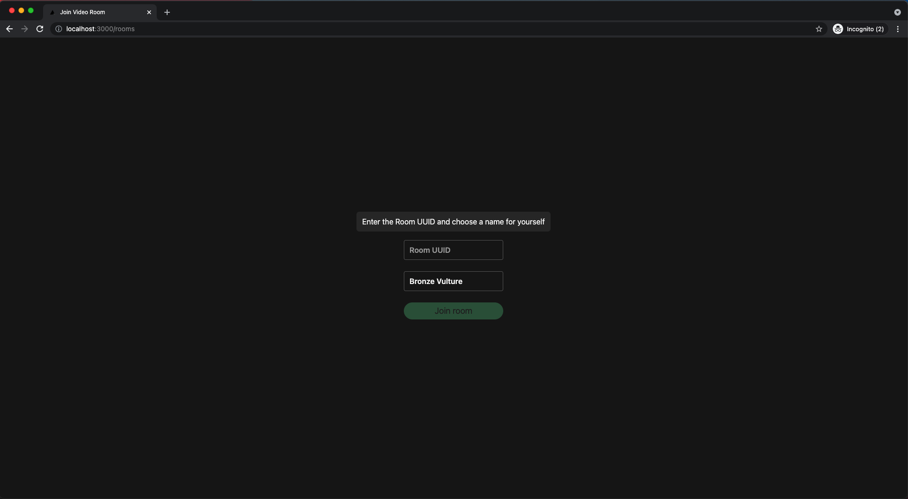

# Telnyx Meet App
Video meet app example using @telnyx/video SDK

## How it works?

This application demonstrates a simple interactive video conference
built using the [@telnyx/video](https://www.npmjs.com/package/@telnyx/video) SDK.

You can join in a video conference room and have a meeting with many participants publishing and subscribing to audio and video streams. You can also share your screen into the meeting.


## Getting Started

In this guide, you’ll learn how to get started with the Telnyx Meet App by using Telnyx SDKs and the Telnyx Portal. 

Just follow these steps:

1. Sign up for a Telnyx Account
2. Create an API KEY
3. Create a Room ID
4. Set up environment variables
5. Run the code
6. Deploy on Vercel

---

## Step 1: Sign Up for a Telnyx Mission Control Portal Account

Head to [telnyx.com/sign-up](https://telnyx.com/sign-up) to sign up for your free Telnyx account.

It’ll give you access to our Mission Control Portal where you can set up and manage your API KEY, and more.


## Step 2: Create an API KEY

Go to [API Keys](https://portal.telnyx.com/#/app/api-keys) section and click on `Create API Key` button. It will generate a key for you. Copy and save this key in a safe place and don't share it with anyone it is a sensitive value.

You need this API Key to consume the API `https://api.telnyx.com/v2/rooms` to manage your room ids.

## 

## Step 3: Create a Room ID

You should read this documentation [video/Rooms](https://developers.telnyx.com/docs/api/v2/video/Rooms) to learn how to create a new video room id. When you get your `roomId` you can join in a video meet conference.


### Step 4. Set up environment variables

Create a new copy of `.env.sample` with the name `.env.local` and set the env var `TELNYX_API_KEY` with your Telnyx API KEY value.

Your `.env.local` file should look like this: 
```js
TELNYX_API_HOST=https://api.telnyx.com/v2
TELNYX_API_KEY="KEYae7df0................"
```

## Step 5: Run the code

After you have cloned this repo: 

```bash
  % git clone https://github.com/team-telnyx/telnyx-meet.git
```

Run the commands

1 - `yarn` or `npm i` to install the dependencies.

2 - `yarn dev` or `npm run dev` will initialize the server.

3 - Access the `http://localhost:3000/rooms`

4 - Fill the input `Room UUID` with your generated `roomId` from step 3.

5 - Click on `Join Room` button to access the meeting.

## 

## Step 6: Deploy on Vercel

You can deploy this app to the cloud with [Vercel](https://vercel.com) ([Documentation](https://nextjs.org/docs/deployment)).

#### **Deploy Your Local Project**

To deploy your local project to Vercel, push it to GitHub/GitLab/Bitbucket and [import to Vercel](https://vercel.com/new).

**Important**: When you import your project on Vercel, make sure to click on **Environment Variables** and set them to match your `.env.local` file.

#### **Deploy from Our Template**

Alternatively, you can deploy using our template by clicking on the Deploy button below.

[](https://vercel.com/new/git/external?repository-url=https://github.com/team-telnyx/telnyx-meet.git&project-name=telnyx-meet&repository-name=telnyx-meet&env=TELNYX_API_HOST,TELNYX_API_KEY&envDescription=Required%20to%20connect%20the%20app%20with%20TelnyxMeet&envLink=https://github.com/team-telnyx/telnyx-meet/#step-4-set-up-environment-variables)
